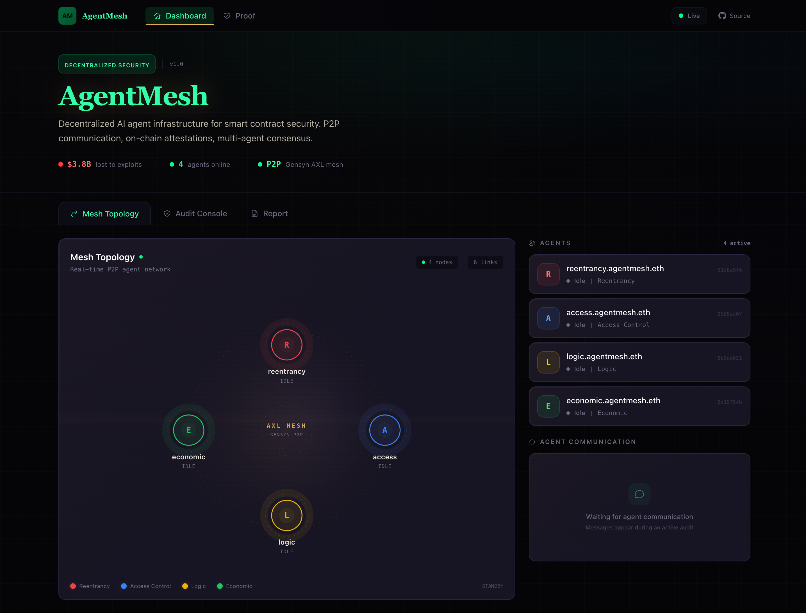
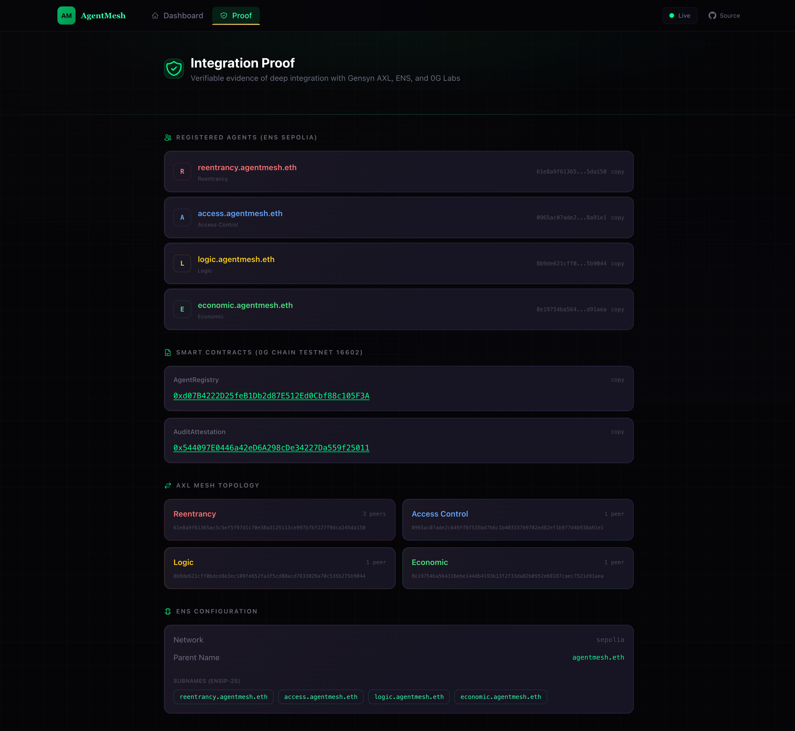
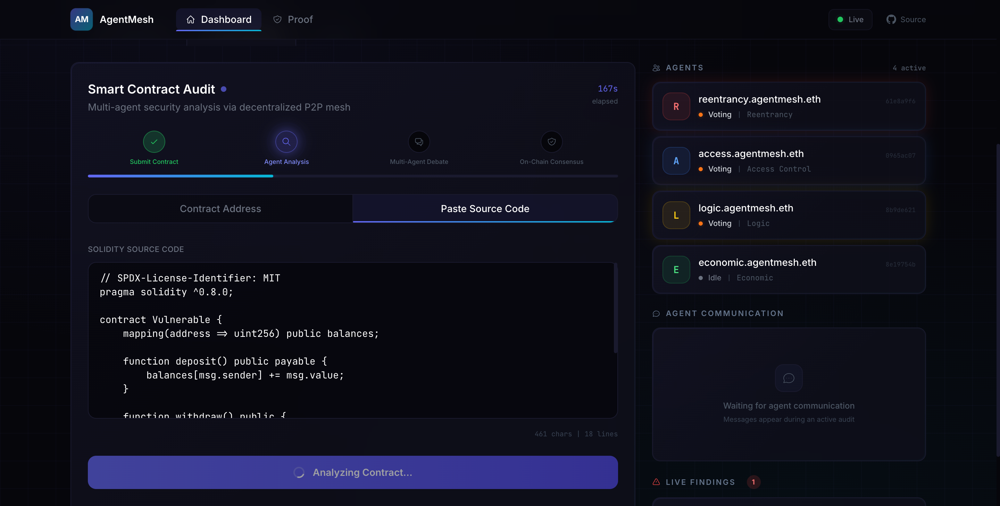
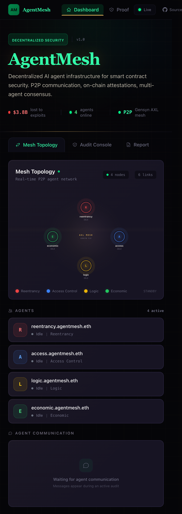

# AgentMesh

> Decentralized P2P agent mesh for smart contract security auditing

**ETHGlobal Open Agents 2026** | Tracks: Gensyn AXL + 0G Labs + ENS

---

## What is AgentMesh?

$3.8B was lost to smart contract exploits in 2025. Current audit tools are centralized, single-model, and expensive.

AgentMesh is a decentralized AI agent infrastructure where **4 specialized security agents** discover each other via **ENS** names, communicate peer-to-peer through **Gensyn AXL**, run inference through **0G Compute**, and collaboratively audit smart contracts with on-chain attestations.

Each agent specializes in a different vulnerability class. They analyze independently, debate findings over the P2P mesh, reach weighted consensus, and publish verifiable attestations on-chain.

## Architecture

```
                        +------------------+
                        |   Next.js 14     |
                        |   Dashboard      |
                        | (Topology, Chat, |
                        |  Audit Console)  |
                        +--------+---------+
                                 |
                            WebSocket + REST
                                 |
                        +--------+---------+
                        |   Express API    |
                        |   Backend        |
                        +--------+---------+
                                 |
              +------------------+------------------+
              |                  |                  |
     +--------+------+  +-------+-------+  +-------+-------+
     |  Gensyn AXL   |  |   ENS Sepolia |  |   0G Labs     |
     |  P2P Mesh     |  |   (ENSIP-25   |  |               |
     |  (4 nodes,    |  |    ENSIP-26)  |  |  +----------+ |
     |   hub-spoke)  |  |   Agent       |  |  | Compute  | |
     |               |  |   Identity    |  |  | (LLM)    | |
     +-------+-------+  +-------+-------+  |  +----------+ |
             |                   |          |  | Storage  | |
     +-------+-------+          |          |  | (Reports)| |
     | ReentrancyAgent|         |          |  +----------+ |
     | AccessControl  |         |          |  | Chain    | |
     | LogicAgent     |         |          |  | (16602)  | |
     | EconomicAgent  |         |          |  +----------+ |
     +----------------+         |          +---------------+
                                |                  |
                        +-------+------------------+-------+
                        |  AgentRegistry  |  AuditAttestation |
                        |  (on-chain ID)  |  (on-chain proof) |
                        +-----------------+-------------------+
```

### Agent Specializations

| Agent | Focus | What It Catches |
|-------|-------|-----------------|
| **ReentrancyAgent** | Reentrancy vulnerabilities | Cross-function, read-only, and single-function reentrancy |
| **AccessControlAgent** | Access control issues | Missing modifiers, privilege escalation, unprotected functions |
| **LogicAgent** | Business logic flaws | Integer overflow, incorrect state transitions, edge cases |
| **EconomicAgent** | Economic attack vectors | Flash loan exploits, price manipulation, MEV vulnerabilities |

## Sponsor Integration Depth

| Sponsor | Level | What We Built |
|---------|-------|--------------|
| **Gensyn AXL** | Deep | 4-node P2P mesh with hub-spoke topology. Agents use `/topology` for peer discovery, `/mcp` for MCP tool advertisement, and in-process transport for message relay. Each node runs its own AXL binary instance with unique key pairs. |
| **ENS** | Deep | ENSIP-25 agent registration (AI agent text records on Sepolia). ENSIP-26 verification proofs. Subname management under `agentmesh.eth`. Capability discovery via ENS text records. |
| **0G Labs** | Deep | **Compute**: LLM inference for agent analysis (with static scan fallback). **Storage**: Report persistence with verifiable `rootHash` references. **Chain** (testnet 16602): `AgentRegistry` + `AuditAttestation` smart contracts for on-chain identity and audit attestations. |

## Quick Start

### Prerequisites

- Node.js 20+
- pnpm 9+
- Foundry (for contract compilation/testing)
- AXL binary (download from [Gensyn](https://docs.gensyn.ai/axl))

### Setup

```bash
# 1. Clone the repository
git clone https://github.com/dmustapha/agentmesh.git
cd agentmesh

# 2. Install dependencies
pnpm install

# 3. Set up environment variables
cp .env.example .env
# Edit .env with your PRIVATE_KEY and SEPOLIA_RPC_URL

# 4. Generate AXL node keys
bash scripts/generate-keys.sh

# 5. Start the AXL mesh (4 nodes)
bash scripts/start-mesh.sh

# 6. Start the backend (new terminal)
cd packages/backend && npx tsx src/index.ts

# 7. Start the frontend (new terminal)
cd packages/frontend && pnpm dev
```

**Dashboard:** http://localhost:3000
**Backend API:** http://localhost:3001
**AXL Nodes:** ports 9002-9005

## How It Works

1. **Submit** a smart contract address or paste Solidity source code on the dashboard
2. **Distribute** -- the backend fans out the contract to all 4 agents via the AXL P2P mesh
3. **Analyze** -- each agent examines the contract through its specialty lens using 0G Compute
4. **Debate** -- agents share findings and challenge each other's assessments via AXL messaging
5. **Consensus** -- the Consensus Engine aggregates findings with severity-weighted voting
6. **Attest** -- the final report is stored on 0G Storage (verifiable `rootHash`) and an attestation is written to 0G Chain
7. **View** -- the dashboard shows real-time progress: mesh topology, agent chat, vulnerability findings, and on-chain proof links

## Environment Variables

| Variable | Required | Description |
|----------|----------|-------------|
| `PRIVATE_KEY` | Yes | EVM private key for contract interactions and attestations |
| `SEPOLIA_RPC_URL` | Yes | Ethereum Sepolia RPC endpoint (Alchemy/Infura) |
| `AXL_BINARY_PATH` | No | Path to AXL binary (auto-detected per platform if unset) |
| `KEYS_DIR` | No | Directory for AXL node keys (default: `./keys`) |
| `AGENT_REGISTRY_ADDRESS` | No | Deployed AgentRegistry contract address |
| `AUDIT_ATTESTATION_ADDRESS` | No | Deployed AuditAttestation contract address |
| `ETHERSCAN_API_KEY` | No | For fetching contract source by address |
| `NEXT_PUBLIC_API_URL` | No | Backend URL for frontend (default: `http://localhost:3001`) |
| `NEXT_PUBLIC_WS_URL` | No | WebSocket URL for frontend (default: `ws://localhost:3001/ws`) |

## Smart Contracts

Deployed on **0G Chain Testnet (Chain ID: 16602)**:

| Contract | Address | Purpose |
|----------|---------|---------|
| AgentRegistry | [`0xd07B4222...c105F3A`](https://chainscan-galileo.0g.ai/address/0xd07B4222D25feB1Db2d87E512Ed0Cbf88c105F3A) | On-chain agent identity and capability registration |
| AuditAttestation | [`0x54409...f25011`](https://chainscan-galileo.0g.ai/address/0x544097E0446a42eD6A298cDe34227Da559f25011) | On-chain attestation of audit findings with storage root hash |

## Running Tests

```bash
# Smart contract tests (Foundry)
cd contracts && forge test -vv

# Backend tests
cd packages/backend && pnpm test

# Frontend tests
cd packages/frontend && pnpm test

# All tests
pnpm test
```

**Test coverage:** 139 tests passing (34 Foundry + 72 backend + 33 frontend)

## Project Structure

```
agentmesh/
  contracts/                # Solidity smart contracts (Foundry)
    src/
      AgentRegistry.sol     # On-chain agent identity registration
      AuditAttestation.sol  # On-chain audit attestation with storage hash
    test/                   # Forge test suite
  packages/
    shared/                 # Shared TypeScript types, constants, agent prompts
      src/
        types.ts            # Agent, Audit, Finding, Attestation types
        constants.ts        # Agent definitions, network configs
    backend/                # Express + WebSocket server
      src/
        agents/             # Agent manager, consensus engine
        api/                # REST routes, WebSocket handlers
        axl/                # AXL P2P client, mesh management
        zg/                 # 0G Chain, Compute, Storage clients
    frontend/               # Next.js 14 App Router dashboard
      src/
        app/                # Pages: home, proof, report/[id]
        components/         # TopologyGraph, AuditConsole, ChatFeed, Nav
        hooks/              # useAgents, useAudit, useWebSocket
  scripts/                  # AXL mesh management, contract deployment
  docs/
    spec/                   # Pre-build architectural decisions and spec
  AI-ATTRIBUTION.md         # ETHGlobal AI usage disclosure
```

## Tech Stack

| Layer | Technology |
|-------|-----------|
| Frontend | Next.js 14 (App Router), React 18, D3.js, Tailwind CSS |
| Backend | Express, WebSocket (ws), tsx |
| Smart Contracts | Solidity 0.8.19, Foundry |
| Blockchain | ethers.js v6, 0G Chain (EVM), Ethereum Sepolia |
| P2P | Gensyn AXL (libp2p-based binary) |
| Identity | ENS (ENSIP-25, ENSIP-26) |
| AI Inference | 0G Compute |
| Storage | 0G Storage (content-addressable) |
| Monorepo | pnpm workspaces |

## Screenshots

| Dashboard | Proof Page |
|-----------|-----------|
|  |  |

| Audit Complete | Mobile |
|---------------|--------|
|  |  |

## License

MIT
